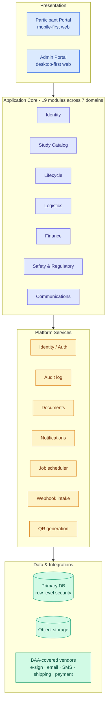
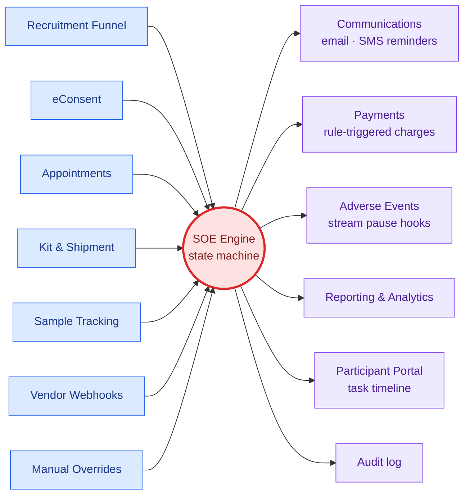
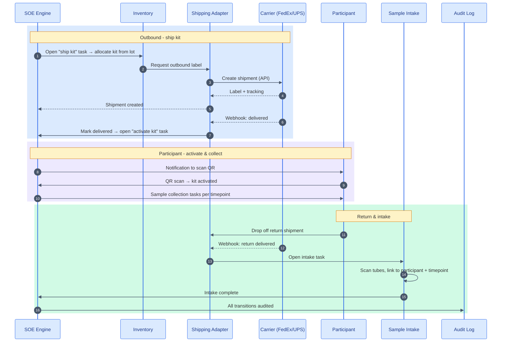
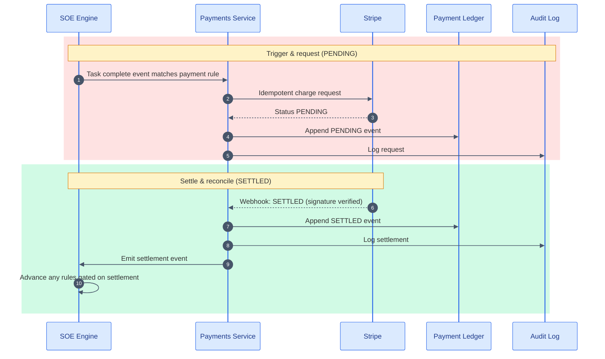
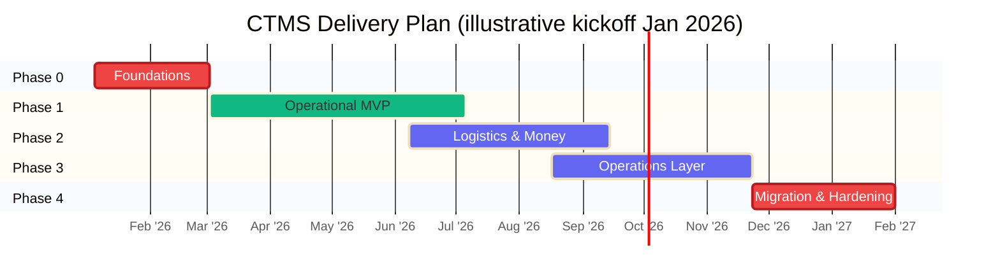
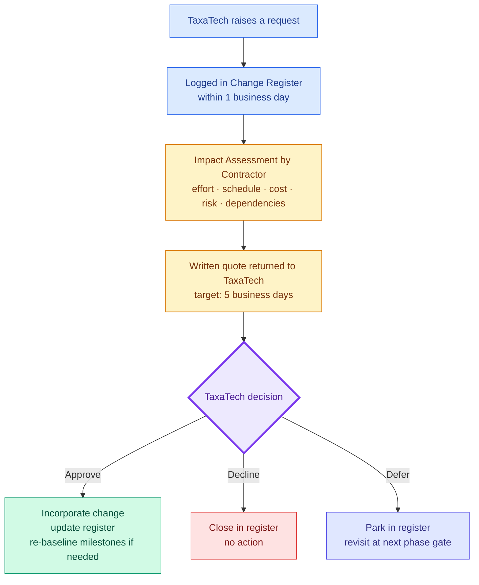

# TaxaTech Clinical Trial Management System- Proposal

**Prepared for:** TaxaTech
**Prepared by:** Kaustumbh Jaiswal
**Document type:** Contractor Proposal (HLD)
**Version:** 1.0
**Date:** 26th May, 2026

---

# 1. Executive Summary

We propose to design, build, and deliver a HIPAA-compliant CTMS that manages the full participant lifecycle - recruitment through study closure - across In-Person, Hybrid, and Decentralized Clinical Trial (DCT) study formats. The platform replaces Jeeva’s core capabilities, adds the modules Jeeva lacks (recruitment funnel, kit shipping, sample tracking, payments, adverse events, inventory, budget, regulatory documents, internal communications, reporting), and automates the participant journey end-to-end.

Three commitments anchor this proposal:

1. **Automation as the operational thesis.** The Schedule of Events (SOE) engine is the event spine of the platform. Every other module either feeds it or reacts to it - which is what allows automation to compound across modules instead of being re-implemented inside each one.
2. **HIPAA compliance from Day One.** Encryption, access control, audit logging, role-based permissions, and BAA-covered vendors are foundational - not retrofitted before launch.
3. **Study isolation enforced by the database.** Multiple concurrent studies are separated by row-level security on `study_id` so that an application bug cannot leak data across studies. UI-level filtering is never the only line of defense.

The engagement is delivered by a focused team of one senior developer and one junior developer, working in close collaboration with Luma. We recommend a **phased delivery over 9–14 months for an operational MVP** that lets TaxaTech run a full study end-to-end, with a further 4–6 months to complete the remaining operational and compliance modules and migrate from Jeeva. Phase boundaries are gated by demonstrable deliverables, not calendar milestones, so TaxaTech sees working software at each gate.

---

# 2. Understanding of Scope

TaxaTech is a clinical research company running decentralized consumer studies in the deodorant and skin-balance categories. The current platform - Jeeva - covers basic CTMS functions but does not adequately serve decentralized study workflows, and operational gaps between Jeeva and the surrounding manual processes have accumulated to the point where they constrain TaxaTech’s growth.

The replacement platform must:

- Manage the complete participant lifecycle: recruitment, eligibility screening, enrollment, e-consent, study task management, survey scheduling, kit shipment and tracking, sample tracking, payments, and study closure.
- Support three study formats concurrently: In-Person, Hybrid, and DCT.
- Match Jeeva’s core CTMS capabilities while improving operational workflows and adding modules Jeeva does not have.
- Remain HIPAA-compliant in every aspect of design, hosting, and integration.
- Scale to thousands of participants across multiple concurrent studies.
- Be architected to support future telehealth (dermatologist consultations) without redesign.
- Be delivered as a clean, well-documented, peer-reviewable, testable, maintainable codebase that another engineer can assume ownership of without a rewrite.

The proposal that follows is structured to meet each of these objectives, with explicit traceability to the 19 modules listed in SOW §2 (see Appendix A) and the five proposal sections required in SOW §7.

A note on timing: the SOW references August 2025 as the Jeeva contract renewal decision point. That date has passed as of this submission. The Delivery Plan (§5) assumes the renewed Jeeva contract bridges to our operational MVP delivery; we welcome the chance to align this assumption with TaxaTech’s actual renewal horizon at kickoff.

---

# 3. Technical Approach

*(Maps to SOW §7 - Technical Approach: Recommended architecture, Technology stack, System design overview)*

## 3.1 Recommended Architecture

We propose a **modular monolith** for v1: a single deployable application organized into clearly bounded modules, backed by a single primary database, with two services carved out from Day One - a **job runner** (background workers, SOE ticks, scheduled reminders) and a **webhook intake** (vendor webhook validation and queueing). This topology gives TaxaTech fast iteration, clear seams for later extraction if needed, and operational simplicity. Service decomposition becomes attractive only when a module’s scaling, deploy cadence, or team ownership diverges meaningfully from the rest - none of those conditions exist at v1, and prematurely splitting a system into microservices is a well-documented source of project failure.

The platform exposes two user surfaces backed by the same core:

- **Participant Portal** - mobile-first web application for participants to complete study activities, scan QR/care codes, watch instructional videos, and view payments.
- **Study Admin Portal** - desktop-first web application for TaxaTech staff (PI, Coordinators, Ops, Finance, Auditor roles) to manage studies, participants, operations, inventory, communications, compliance, and reporting.

At the heart of the architecture is the **Schedule of Events (SOE) engine** - a deterministic state machine that tracks every participant’s position in their study timeline, fires triggers when tasks complete or external events arrive (kit delivered, sample received, payment settled), and emits events that downstream modules subscribe to. Treating the SOE as the central event spine - rather than as a feature inside a “scheduling” module - is the single most important architectural decision in this proposal. It is what allows automation to compound across modules.

Three architectural commitments support the SOW’s technical requirements:

| Requirement | Architectural commitment |
| --- | --- |
| Multi-study isolation at the database level | **Row-level security keyed on `study_id`** - every PHI-bearing table carries `study_id`, and the database refuses to return rows outside the caller’s allowed studies |
| HIPAA from Day One | Encryption at rest and in transit, append-only audit log with cryptographic anchoring, federated identity with MFA for staff, column-level PHI encryption, no PHI in logs |
| Future telehealth without redesign | `Appointment` modeled with a `modality` field (in-person, e-visit, future video); identity, consent, and audit reserved for video session metadata; vendor video adapter is a deferred adapter, not a deferred rewrite |

Every external vendor integration sits behind an internal **adapter interface** - `ShippingAdapter`, `PaymentAdapter`, `ESignAdapter`, `EmailAdapter`, `SMSAdapter`. Swapping FedEx for UPS, or DocuSign for Dropbox Sign, is a new adapter implementing the same interface; nothing in the domain layer changes. TaxaTech is not locked to any single vendor for the life of the system.

## 3.2 Technology Stack

The proposal is intentionally vendor-and-stack agnostic at the language and framework level: final choices are confirmed at kickoff against TaxaTech’s preferences on cost, lock-in, and existing relationships. The categories and our recommendation posture:

| Category | SOW-suggested | Our posture |
| --- | --- | --- |
| Application language and runtime | - | TypeScript on Node.js (recommended) - strong typing, large ecosystem, single language across portals and backend reduces team switching cost on a small team |
| Database | - | **PostgreSQL** - row-level security is native; mature, HIPAA-eligible across all major clouds |
| Identity | Auth0, AWS Cognito | Single IdP, MFA mandatory for staff; SSO-ready |
| HIPAA-compliant hosting | AWS, Azure, GCP | AWS recommended (broadest HIPAA-eligible service catalog and BAA); final cloud confirmed against TaxaTech footprint |
| E-signature | DocuSign, Dropbox Sign | Signed PDFs stored in our object store as source of truth; vendor is transport only |
| Email | SendGrid, Postmark | Templates owned by the platform |
| SMS | Twilio | Twilio is the de-facto choice for clinical SMS with BAA |
| Shipping & tracking | FedEx, UPS, USPS | Multi-carrier from Day One via the adapter pattern |
| Payment processing | Stripe | Stripe with BAA-eligible plan; webhook-driven reconciliation |
| Video (future) | Twilio Video, Daily.co | Not implemented v1; adapter seam reserved |

Where the SOW lists alternatives, we treat them as interchangeable behind our adapter interfaces. Final vendor selection at kickoff includes BAA availability verification as a hard gate.

## 3.3 System Design Overview

The platform is organized into **19 modules** (matching SOW §2 exactly - see Appendix A for the full coverage matrix), grouped into seven domains:

1. **Identity** - staff users, participant accounts, roles, permissions.
2. **Study Catalog** - studies, arms, timepoints, SOE definitions, scientific parameters.
3. **Lifecycle** - participants, enrollments, consent records, task instances, waitlists.
4. **Logistics** - kits, shipments, samples, inventory.
5. **Finance** - payment rules, payment events (an append-only ledger), budget lines.
6. **Safety & Regulatory** - adverse events, AE report templates, regulatory documents, audit log.
7. **Communications** - messages, templates, appointments.

Cross-cutting concerns - authentication, authorization, audit logging, study isolation, observability - are implemented at the platform layer rather than re-implemented in each module.

**Conceptual layering:**

**The SOE engine as event spine:**

**Three event-driven flows give a sense of the design’s shape:**

*Recruitment → Consent → Enrollment.* A visitor responds to a recruitment ad, completes the eligibility screener, gets a qualifying outcome, creates an account, signs consent via the e-signature flow, and is automatically enrolled - the SOE engine generates the participant’s task timeline at the moment consent is signed, and the first tasks appear in the Participant Portal seconds later. No manual hand-off occurs at any step.

*DCT kit lifecycle.* The SOE opens a “ship kit” task; inventory allocates a kit from a lot; the shipping adapter creates a label via the carrier API; the carrier delivers the package and webhooks back to us; the SOE opens a “activate kit” task; the participant scans the QR code to activate; subsequent task instances govern sample collection; a return label is auto-generated; on return delivery, sample intake scans tubes and links them to participant and timepoint. The participant performs only the irreducible actions; everything else flows from system state.

*Payment trigger → settle → reconcile.* A task completion event matches a payment rule; the Payments service issues an idempotent charge via Stripe; the processor returns pending; on the settlement webhook, the payment event status moves to SETTLED and the audit log records the transition. The SOE may advance further if a rule depends on settlement. Critically, settlement - not request - is what counts; nothing in the SOE advances on hope alone.

**DCT kit lifecycle - sequence view:**

**Payment trigger → settle → reconcile - sequence view:**

The full data model spans seven domains and approximately 25 entities. Detailed entity definitions, the SOE state machine, sequence diagrams for high-leverage flows, the API surface, and module-by-module designs are available as engineering artifacts on request.

---

# 4. Compliance Approach

*(Maps to SOW §7 - Compliance Approach: HIPAA strategy, Security controls, Hosting recommendations)*

## 4.1 HIPAA Strategy

HIPAA compliance is treated as a property of the whole system, enforced at every layer - not a checklist completed before launch. Our strategy covers the six categories the SOW requires:

| Control | Implementation |
| --- | --- |
| **Encryption at rest** | Database, object storage, and backup snapshots encrypted via cloud-managed keys; PHI columns additionally encrypted at the column level with per-study envelope keys |
| **Encryption in transit** | TLS 1.2+ on all connections (internal and external); webhooks signature-verified using each vendor’s published mechanism |
| **Access control** | Federated identity via SSO with MFA mandatory for all staff; participant accounts scoped to their own records only; service identities scoped per-job with narrowest possible role |
| **Audit logging** | Append-only audit log of every PHI read and write - actor, action, target, timestamp, and before/after hashes; reads logged at request granularity, writes at row granularity |
| **Role-based permissions** | Six baseline staff roles (PI, Coordinator, Ops, Finance, Auditor, ReadOnly) with least-privilege defaults; role changes require two-person approval |
| **HIPAA-eligible infrastructure** | All hosting and SaaS dependencies HIPAA-eligible with BAA in place before go-live; BAA inventory maintained as a compliance artifact |
| **Business Associate Agreements** | BAA negotiation begins in Phase 0, in parallel with build; no vendor that handles PHI is integrated without an executed BAA |

A continuous **Compliance Dashboard** (one of three baseline operational dashboards) makes compliance evidence visible day-to-day - audit log volume trends, manual overrides per study, open AE reports, BAA inventory status - so that compliance posture is observable, not assembled retroactively at audit time.

## 4.2 Security Controls

A STRIDE-aligned threat model drives the control set:

| Threat | Primary mitigation |
| --- | --- |
| Spoofing identity | MFA mandatory for staff; participant sessions signed and short-lived; webhook signature verification on every vendor callback |
| Tampering with data | Append-only audit log; database constraints; row-level security; signed object storage URIs |
| Repudiation | Every PHI write linked to actor and request; e-signature consents timestamped and signed by the vendor in addition to internal audit |
| Information disclosure | RLS at the database; column-level encryption for PHI; redacted logs; production data never flows to non-production |
| Denial of service | Rate limiting on public endpoints; queue-based ingest absorbs traffic spikes; CDN in front of static assets |
| Elevation of privilege | Least-privilege RBAC by default; production database access is broken-glass only with logged justification |

**Specific controls worth calling out:**

- **Audit log immutability** is enforced at three layers: database (no UPDATE/DELETE permission on the audit table for any application role), periodic Merkle-root anchoring to a separately-controlled store (so tampering with old rows is detectable), and write-once-read-many backup retention for the regulatory horizon.
- **PHI redaction in logs and metrics** is automatic via a redaction layer that reads column metadata and substitutes redacted tokens - PHI cannot leak through application logs by construction, not by discipline.
- **Secrets management** uses a managed vault; secrets are never stored in source; rotation policy is quarterly for signing keys and annual (or on compromise) for vendor API keys.
- **Key rotation** for column-level encryption runs as a background re-encryption job per study; rotation events are themselves audited.
- **Vulnerability management** runs dependency scanning on every PR (high/critical findings block merge), an annual external penetration test before launch and yearly thereafter, and a documented disclosure path.

## 4.3 Hosting Recommendations

We recommend **AWS** as the primary cloud, based on three considerations: AWS has the broadest HIPAA-eligible service catalog of the major clouds, has executed BAAs with the largest number of SaaS partners listed in SOW §4, and offers the most mature row-level-security-friendly managed PostgreSQL (RDS for PostgreSQL with Aurora as a scale option). Azure and GCP are both viable; we accommodate either if TaxaTech has an existing relationship.

**Hosting posture:**

- **Single primary US region** for v1 (US-East-2 recommended for cost; US-West-2 viable for resilience). US-based participants and the absence of cross-border data residency requirements make single-region appropriate at v1 scale; multi-region active-active is not justified by v1 load.
- **Cross-region replication of backups** for disaster recovery - RPO ≤ 15 minutes for PHI, ≤ 5 minutes for the audit log; RTO ≤ 4 hours for full restore.
- **Point-in-time recovery** for the primary database.
- **HIPAA-eligible region and services only** - every cloud resource validated against the cloud provider’s published HIPAA-eligible service list before adoption.
- **DR drills twice yearly** with timed restores; results documented and reviewed with TaxaTech.

Production data never copies to non-production. Staging and development environments use synthesized or de-identified data exclusively.

---

# 5. Delivery Plan

*(Maps to SOW §7 - Delivery Plan: Project phases, Timeline estimates, Resource requirements, Milestones)*

## 5.1 Project Phases

We propose five phases. Each phase boundary is a review gate at which TaxaTech inspects working software and signs off before the next phase opens.

**Phase 0 - Foundations**
HIPAA-eligible hosting, identity provider, audit log scaffolding, study isolation (RLS) primitives, deployment pipeline, baseline observability, vendor BAA initiation. No user-visible features yet, but every later phase depends on this being right.

**Phase 1 - Operational MVP**
The path that lets TaxaTech actually run a study end-to-end: Study Management, the SOE engine, Participant Portal core, eConsent, Communications (email + SMS), basic Admin Dashboard, Recruitment Funnel with waitlists and enrollment caps. By end of Phase 1, a study can be configured, a participant can be recruited, screened, consented, and progressed through tasks - TaxaTech can run a small DCT-format pilot study on the new platform.

**Phase 2 - Logistics & Money**
Kit Shipment & Tracking (outbound, return, lost-package handling), Sample & Tube Tracking, Inventory Management, Payments (rule engine, processor integration, reconciliation), Budget & Financial Tracking. By end of Phase 2, full DCT and Hybrid flows work end-to-end including the physical logistics and participant payments.

**Phase 3 - Operations Layer**
Adverse Events with configurable templates, Regulatory Documents repository, Staff & Task Assignment, Internal Communications, Reporting & Analytics (operational reports plus CSV / microbiome exports), QR Code Auto-Generation with batch export, Appointments & E-Visits with duplication and bulk actions. These modules increase staff leverage but are not blockers for participant flow.

**Phase 4 - Migration & Hardening**
Data import from Jeeva (export feasibility was de-risked in Phase 0), parallel-run period during which Jeeva remains read-only as a safety net, staff training, formal cutover, post-cutover hardening.

## 5.2 Timeline Estimates

Timeline is anchored against the confirmed two-person team (1 senior + 1 junior). The estimates below are realistic - they are not the aggressive 28-week pace appropriate for a larger team. We have set timelines we believe we can hit and exceed, not timelines that look good on paper.

| Phase | Elapsed time | Notes |
| --- | --- | --- |
| Phase 0 - Foundations | 6–8 weeks | Hosting, identity, audit, RLS, CI/CD, BAA initiation |
| Phase 1 - Operational MVP | 14–18 weeks | The largest single phase; ends with TaxaTech running a pilot |
| Phase 2 - Logistics & Money | 10–14 weeks | Overlaps Phase 1 for ~4 weeks once Phase 1 SOE is stable |
| Phase 3 - Operations Layer | 10–14 weeks | Can overlap Phase 2 for ~4 weeks |
| Phase 4 - Migration & Hardening | 6–10 weeks | Includes parallel-run window with Jeeva |

**End-to-end timeline ranges:**

- **Operational MVP available (end of Phase 2):** 9–11 months from kickoff
- **All 19 modules at production polish (end of Phase 3):** 12–15 months from kickoff
- **Full Jeeva cutover (end of Phase 4):** 14–18 months from kickoff

These ranges reflect normal variance - vendor BAA negotiation slowness, scope discoveries during build, holiday cadence. We commit to monthly written progress reports tracking actual versus planned, with deviations explained before they compound.

**Indicative phase plan (upper-bound weeks shown; overlaps reflect §5.1 phasing):**

## 5.3 Resource Requirements

| Role | Allocation | Responsibilities |
| --- | --- | --- |
| **Senior Developer** | 1.0 FTE for engagement duration | Architecture decisions, security model, SOE engine, integration adapters, code review, mentorship of junior, primary TaxaTech liaison |
| **Junior Developer** | 1.0 FTE for engagement duration | Feature implementation, portal screens, test authoring, documentation, scoped modules under senior review |

We are deliberately proposing a small, senior-heavy team rather than a larger team with thinner per-person ownership. The trade-offs are explicit and managed (§6.3 Risks).

**TaxaTech-side commitments expected:**

| TaxaTech role | Expected involvement |
| --- | --- |
| **Principal Investigator (Luma)** | Weekly 60-minute sync; same-day asynchronous response on scope and protocol questions; sign-off at each phase gate |
| **Operations / Coordinator stakeholder** | Bi-weekly 60-minute sync for workflow review; available for SME questions on study operations |
| **Regulatory / Compliance lead** | Available for BAA execution decisions, IRB-adjacent questions, audit document reviews |
| **Finance representative** | Two sessions in Phase 2 to confirm payment rules and reconciliation expectations |

We do not require dedicated TaxaTech FTE; we do require timely answers and named owners.

**Third-party costs (TaxaTech-borne):**

| Category | Cost driver |
| --- | --- |
| Cloud hosting | Compute, database, object storage, backup egress - scales with participant volume |
| Identity provider | Per-user-per-month (staff) plus per-MAU (participants) |
| E-signature | Per-envelope |
| Email | Per-message volume tier |
| SMS | Per-message, US destinations |
| Shipping | Per-label, carrier-rated |
| Payment processor | Per-transaction percentage |
| Penetration test (annual) | Fixed fee |

A pricing-model worksheet is delivered at the close of Phase 0 to support TaxaTech’s operating-cost forecasting.

## 5.4 Milestones

Each milestone is a demonstrable deliverable TaxaTech can inspect, not a calendar date.

| # | Milestone | Phase | Acceptance criterion |
| --- | --- | --- | --- |
| M1 | Hosting + identity + audit foundation | 0 | A logged-in staff user, every action audited, in a HIPAA-eligible environment |
| M2 | Study isolation primitives | 0 | RLS-enforced study scoping demonstrated with a deliberately mis-scoped query failing |
| M3 | Configurable study + active SOE | 1 | One study configured end-to-end, a synthetic participant progressed through their full task timeline |
| M4 | eConsent end-to-end | 1 | Consent signed via vendor, PDF stored, audit row written, consent versioning demonstrated |
| M5 | Participant Portal pilot-ready | 1 | Real TaxaTech pilot participant onboarded; staff can observe progression in the Admin Portal |
| M6 | DCT kit lifecycle live | 2 | A kit shipped, delivered, activated by QR, returned, and intake completed - end-to-end |
| M7 | Automated payment cycle | 2 | A task completion triggers a Stripe charge that settles; reconciliation visible in the ledger |
| M8 | Sample tracking demonstrated | 2 | Tubes scanned, linked to participant and timepoint, condition recorded; collection history queryable |
| M9 | AE workflow with configurable template | 3 | AE reported with photos, triaged, resolved; PI notified within SLO |
| M10 | Reporting & exports | 3 | Per-study operational reports plus CSV / microbiome exports; cross-study analytics demonstrable |
| M11 | Jeeva data import validated | 4 | Jeeva export loaded into staging; automated diff report under tolerance threshold |
| M12 | Production cutover | 4 | Live participants migrated, Jeeva read-only, new platform serving production traffic |

---

# 6. Commercial Proposal

*(Maps to SOW §7 - Commercial Proposal: Cost estimates, Assumptions, Risks, Change management process)*

## 6.1 Cost Estimates

Cost figures below are **indicative ranges** derived from the sizing rationale in §6.1.1. They are not yet contractual: the lower bound is firm-fixed once the §6.2 inputs are confirmed at kickoff; the upper bound is the variance budget we recommend TaxaTech reserve. The structure and methodology are fixed.

**Engagement model:** Fixed-price per phase with a documented change-management process (§6.4) for in-engagement scope changes. Fixed price gives TaxaTech cost certainty; the change-management process gives both parties a defined path when scope shifts.

### 6.1.1 Sizing rationale (how we landed on the numbers)

The cost ranges below are built bottom-up from the §5.3 team composition and the §5.2 timeline, then cross-checked against the operational scale TaxaTech is migrating from. Three reference points:

| **Reference** | **Source** | **Implication for sizing** |
| --- | --- | --- |
| **Jeeva platform footprint** | Public profile: 9 modules, ~40K cumulative users across all customers, pricing starts $2,000/yr usage-based per participant, $1.36M total funding raised since 2019 | TaxaTech is a small-to-mid customer in this segment; we are not building a hyperscaler. Target footprint: low thousands of active participants across 3 to 8 concurrent studies, not tens of thousands concurrent. |
| **Scope breadth** | 19 modules in this proposal vs Jeeva's 9 modules | ~2x the functional surface area, which is why a 14 to 18 month build is realistic for two people rather than the 6 to 9 months a Jeeva-equivalent rebuild would take. |
| **Team rates** | 1 Senior @ blended $125/hr, 1 Junior @ blended $60/hr, ~36 productive hours per person-week | Per-week burn rate of approximately $6.66K for the two-person team, the basis for every phase number below. |

**Why ranges, not point estimates:** Phase boundaries from §5.2 are themselves ranges (e.g., Phase 1 is 14–18 weeks). The cost lower bound assumes we hit the lower-bound week count for that phase; the upper bound assumes the upper-bound count. We commit to the lower bound at kickoff; the spread reserves TaxaTech's contingency without padding the headline.

### 6.1.2 Phase-level cost structure

| **Phase** | **Engineering effort** | **Third-party setup** | **Contingency (10%)** | **Phase total (range)** |
| --- | --- | --- | --- | --- |
| Phase 0 - Foundations | $40K – $53K | $3K – $8K (BAA legal review) | $4K – $5K | **$47K – $66K** |
| Phase 1 - Operational MVP | $93K – $120K | included | $9K – $12K | **$102K – $132K** |
| Phase 2 - Logistics & Money | $67K – $93K | included | $7K – $9K | **$74K – $102K** |
| Phase 3 - Operations Layer | $67K – $93K | included | $7K – $9K | **$74K – $102K** |
| Phase 4 - Migration & Hardening | $40K – $67K | $18K – $30K (external pen test) | $4K – $7K | **$62K – $104K** |
| **Total engineering engagement** | **$307K – $426K** | **$21K – $38K** | **$31K – $42K** | **~$365K – $510K** |

<aside>
💡 **Headline: `~$365K-$510K all-in fixed-price`** to replace Jeeva with a HIPAA-compliant 19-module CTMS across 14-18 months. For reference, an equivalent commercial CTMS (Veeva, Medidata, IQVIA) typically starts at $400K-$1M annual SaaS license for similar scope, and does not deliver source code or eliminate vendor lock-in.

</aside>

### 6.1.3 TaxaTech-borne operating costs (excluded from engineering)

Estimates assume the target footprint of §6.1.1 (low thousands of active participants, 3–8 concurrent studies, mostly US-based traffic). Refined at end of Phase 0 against the actual study-mix.

| **Category** | **Estimated monthly** | **Notes** |
| --- | --- | --- |
| Cloud hosting (AWS, HIPAA-eligible) | $1,200 – $3,000 | RDS PostgreSQL, ECS/Fargate, S3, backups, CloudWatch |
| Identity provider | $700 – $2,500 | Staff seats + per-MAU participants (Auth0 B2C HIPAA tier or equivalent) |
| E-signature (DocuSign HIPAA) | $200 – $600 | Per-envelope; ~50–150 consents/month |
| Email (SendGrid HIPAA Pro) | $90 – $250 | Templated transactional + reminder volume |
| SMS (Twilio) | $150 – $600 | US destinations; participant reminders + 2FA |
| Shipping labels | $1,000 – $12,000 | Volatile pass-through; carrier-rated $5–15/label × volume |
| Payment processor (Stripe) | 2.9% + $0.30 per txn | Pass-through of participant payments |
| Annual penetration test (amortized) | $1,500 – $2,500 | $18K–$30K/yr ÷ 12 |
| **Estimated monthly fixed cost** | **~$3,800 – $9,500** | **Excluding shipping and payment processor pass-throughs** |

### 6.1.4 Payment milestones

| **At** | **% of total** |
| --- | --- |
| Engagement signature | 10% |
| Phase 0 acceptance | 10% |
| Phase 1 acceptance | 25% |
| Phase 2 acceptance | 25% |
| Phase 3 acceptance | 20% |
| Phase 4 acceptance (cutover complete) | 10% |

A separate optional **post-launch retainer** is proposed in §7.3 for ongoing maintenance ($3K-$9K/month depending on tier).

### 6.1.5 Sources used for sizing

The cost ranges in this section are anchored to publicly verifiable data points available for Jeeva Trials. Citations:

| **#** | **Data point used** | **Source** |
| --- | --- | --- |
| **S1** | Jeeva platform: 9 modules, 40K+ cumulative users & patients, named customers (KCRS, Uncommon Cures, CombinedBrain, ImmunoACT, Frantz Viral Therapeutics) | [Jeeva Trials - homepage](https://jeevatrials.com/) |
| **S2** | Jeeva pricing: starting $2,000/year, usage-based per participant per month; serves freelancers through enterprise | [Jeeva eClinical Cloud pricing - Capterra](https://www.capterra.com/p/232762/Jeeva-eClinical-Cloud/) |
| **S3** | Jeeva funding history: $1.36M raised since 2019; investors include VIPC, NSF, IGNITE Grant | [Jeeva Clinical Trials - PitchBook profile](https://pitchbook.com/profiles/company/267821-56) |
| **S4** | Jeeva company profile: founded 2019, HQ Manassas VA, headcount range | [Jeeva - Crunchbase profile](https://www.crunchbase.com/organization/jeeva-informatics-solutions) |
| **S5** | Jeeva eClinical platform breadth and module set used for the 19-vs-9 module-count comparison | [Jeeva eClinical Platform - product page](https://jeevatrials.com/eclinical-platform/) |
| **S6** | Senior/Junior developer blended rates ($125 / $60 per hour), nearshore/offshore-blended HIPAA-compliance contracting band | Internal rate card; in-line with [BLS Computer & IT Occupations 2026](https://www.bls.gov/ooh/computer-and-information-technology/home.htm) and standard healthcare-software consulting market rates |
| **S7** | Productive-hour convention (~36 hrs/person/week after meetings, code review, ops) | Internal estimating standard, applied across all phase totals |
| **S8** | Operating-cost ranges (AWS HIPAA, Auth0, DocuSign, SendGrid, Twilio, Stripe) | Vendor public pricing pages as of May 2026 |

<aside>
🧮 **Methodology in one line:** weekly burn ≈ (36 hrs × $125 Senior) + (36 hrs × $60 Junior) = **~$6,660/week**, multiplied by the lower- and upper-bound week counts from §5.2 per phase, plus a 10% contingency line and the third-party setup items called out in the §6.1.2 table.

</aside>

## 6.2 Assumptions

This proposal is built on the following assumptions. If any prove incorrect, the change-management process (§6.4) applies.

**Scope assumptions:**

1. The 19 modules listed in SOW §2 (and enumerated in Appendix A) represent the full functional scope. Additional modules are out of scope and processed via change management.
2. No native mobile applications in v1; the Participant Portal is a mobile-first responsive web application.
3. No real-time video, EHR integration, AI/ML features, or analytics-grade data warehouse in v1. Each is architecturally accommodated for future addition.

**TaxaTech input assumptions:**

1. TaxaTech provides timely answers (≤ 2 business days) on scope, protocol, and compliance questions through the weekly sync cadence.
2. TaxaTech executes its side of vendor BAAs within reasonable timeframes; BAA delays beyond 30 days from request constitute schedule risk.
3. TaxaTech provides at least one IRB-approved protocol document at kickoff to size SOE complexity.
4. TaxaTech provides access to at least one Jeeva export sample within the first 2 weeks of Phase 0 to validate migration feasibility.

**Operational assumptions:**

1. TaxaTech owns ongoing operating costs (cloud, third-party services, processor fees) from the moment the production environment exists, including pre-launch staging consumption.
2. Penetration testing, IRB submissions, and regulatory filings are TaxaTech’s responsibility; we support with system documentation and security artifacts.
3. The renewed Jeeva contract bridges to our Phase 4 cutover; if the bridge window is shorter than our plan, we revisit phasing at kickoff.

## 6.3 Risks

Risks are surfaced explicitly with our proposed mitigations. We commit to maintaining and reviewing this risk register monthly throughout the engagement.

| # | Risk | Likelihood | Impact | Mitigation |
| --- | --- | --- | --- | --- |
| R1 | **Jeeva data export proves lossy or undocumented** | Medium | High | Export feasibility study in Phase 0 before any cutover commitment; loss tolerance defined with PI before Phase 4; manual reconciliation budget reserved |
| R2 | **Vendor BAA negotiation slower than expected** | Medium | High | BAA initiation begins Day One of Phase 0 in parallel with build; backup vendor identified for each category |
| R3 | **Two-person team bus factor** | Low | High | Daily check-in cadence between senior and junior; every module documented before it is considered complete; TaxaTech has Day-One read access to repo and infrastructure; all design decisions captured as Architecture Decision Records (ADRs); cross-coverage on all critical paths |
| R4 | **Senior or junior unavailable (illness, vacation, attrition)** | Medium | Medium | Planned-leave calendar shared with TaxaTech at engagement start; emergency continuation arrangement with vetted contractor backup identified before Phase 1; documentation discipline means a successor can pick up cleanly |
| R5 | **SOE engine complexity underestimated** | Medium | Medium | The SOE engine is the most carefully designed subsystem in our architecture; Phase 1 is sized generously around it; complex rule logic uses code-defined predicates rather than DSL extensions |
| R6 | **HIPAA audit findings late in build** | Low | High | Compliance review at end of Phase 0 (foundation) and Phase 1 (first feature surface), not only pre-launch; external penetration test scheduled before go-live, not after |
| R7 | **Scope creep from “while you’re in there” requests** | High | Medium | Formal change-management process (§6.4) from Week 1; informal requests are politely re-routed through the process |
| R8 | **Integration vendor changes API or pricing mid-engagement** | Low | Medium | Adapter pattern isolates vendor changes; pricing changes pass through to TaxaTech under the stated assumption that operating costs are TaxaTech-borne |
| R9 | **IRB or protocol changes during build** | Medium | Medium | SOE versioning is a first-class system capability; existing enrollments are pinned to their SOE version unless explicitly migrated |
| R10 | **Jeeva renewal horizon shorter than our delivery plan** | Unknown | High | First topic at kickoff; phasing reshaped if necessary; pilot study can run on the platform at end of Phase 1 well before full cutover |

The two-person team risk (R3) deserves a specific note: we are choosing a small, senior-heavy team intentionally. It produces better-designed software at this scale than a larger team would, and it keeps coordination overhead low. We address its inherent risks with documentation discipline (every module is shipped with a README and runbook), with ADRs (every meaningful decision is captured in version control), and with the cross-coverage practices noted above. TaxaTech’s Day-One read access to the codebase and infrastructure-as-code means a successor - whether a future hire or a TaxaTech-employed engineer - can assume ownership without a rewrite.

## 6.4 Change Management Process

In-engagement scope changes are inevitable. The process below makes them visible and decisive.

**Process commitments:**

- Every change request is logged within 1 business day of receipt, even if no quote is yet possible.
- Impact assessments are written, not verbal - the written record protects both parties.
- Cost impacts are quoted at the same rate structure as the original engagement; no penalty pricing.
- Changes under a small-effort threshold (defined at kickoff, e.g. ≤ 4 person-hours) are absorbed without re-quote up to a monthly cap.
- The Change Register is shared with TaxaTech as a living document; both parties can read it at any time.
- Major scope shifts may trigger a re-plan rather than a single change quote; we will surface this honestly when it applies.

---

# 7. Long-Term Support

*(Maps to SOW §7 - Long-Term Support: Documentation plan, Knowledge transfer plan, Maintenance approach, Future telehealth expansion strategy)*

## 7.1 Documentation Plan

Documentation is treated as a deliverable, not a wrap-up activity. By the end of each phase, the documentation set is current - not “to be updated before final handover.”

**Documentation set:**

| Artifact | Purpose | When updated |
| --- | --- | --- |
| **Module READMEs** | Each module ships with a README covering responsibilities, public interface, key entities, and operational concerns | Continuously, in the same PR as code changes |
| **Architecture Decision Records (ADRs)** | Every meaningful design decision - why we chose RLS over schema-per-study, why modular monolith, why this rule DSL - captured in version control | When the decision is made |
| **API documentation** | Auto-generated from code annotations; covers public API surface used by both portals and vendor webhook contracts | On every release |
| **Runbooks** | Step-by-step procedures for: vendor outage response (per vendor), database failover, audit log integrity check, manual data correction, broken-glass production access, DR drill execution, cutover, rollback | Created alongside the alert or scenario they address |
| **Operational playbook** | Day-in-the-life for Coordinators, Ops, Finance, and PI roles within the Admin Portal | End of Phase 1 (initial); refreshed at end of Phase 3 |
| **Infrastructure-as-code** | The hosting environment as Terraform (or equivalent); reproducible from source | Continuously |
| **Data dictionary** | Every entity, every field, sensitivity tier (PHI / Sensitive / Operational), source of truth | Continuously |
| **Compliance pack** | BAA inventory, security control matrix mapped to HIPAA Security Rule, audit log retention policy, penetration test reports | End of each phase |
| **Final handover packet** | Index of everything above plus a “if you only read three documents, read these” guide | Phase 4 |

All documentation lives in the same repository as the code. TaxaTech has read access from Day One.

## 7.2 Knowledge Transfer Plan

Knowledge transfer is continuous, not concentrated at the end of the engagement.

**Continuous KT practices:**

- **Day-One TaxaTech access** to the code repository, infrastructure-as-code, runbook directory, and ADR set. TaxaTech can audit progress at any time.
- **Weekly demo** as part of the PI sync - every week, working software is shown, even when progress is foundational.
- **Phase gate review sessions** - at each phase boundary, a 90-minute session walks through what shipped, what is open, what is at risk. Recordings retained.
- **Pairing offer** - at any point during the engagement, TaxaTech may nominate a future technical lead to pair-program with our senior; we accommodate up to 1 day/week of pairing time without additional cost.

**Formal handover at Phase 4:**

- **Codebase orientation** (2 sessions × 2 hours): module-by-module walk-through with the receiving owner.
- **Operations orientation** (2 sessions × 2 hours): on-call procedures, runbooks, dashboards, alert response.
- **Compliance orientation** (1 session × 2 hours): BAA inventory, audit log retrieval, evidence-gathering for hypothetical audits.
- **Live incident drill** (1 session × 3 hours): a simulated incident with the receiving owner driving response, our team coaching.
- **30-day post-handover availability** - bug-fix response and orientation questions covered at no additional cost.

**Receiving owner profile:**

We recommend TaxaTech identify the receiving owner - whether a future internal hire or an ongoing Contractor retainer - by end of Phase 2. Earlier identification means longer pairing exposure; later identification still works but compresses the handover window.

## 7.3 Maintenance Approach

Post-launch, Contractor offers an optional retainer for ongoing maintenance. TaxaTech is not obligated to engage the retainer - the system is designed to be picked up by any competent engineer - but we strongly recommend it for at least the first 12 months post-cutover.

**Retainer tiers:**

| Tier | Coverage | Suitability |
| --- | --- | --- |
| **Tier 1 - Essential** | Bug fixes within SLO; dependency updates (security patches, library minors); monthly health check; ad-hoc questions | TaxaTech-internal engineering team primary, Contractor backstop |
| **Tier 2 - Standard** *(recommended)* | Tier 1 + small feature changes within a monthly hour cap; quarterly architecture review; on-call rotation participation; vendor escalation point | First 12 months post-cutover |
| **Tier 3 - Active development** | Tier 2 + named team continuation for new modules, integrations, or expansion (e.g., telehealth) | When TaxaTech wants continued capacity beyond v1 |

**Maintenance commitments under Tier 2 (the recommended default):**

| Category | Commitment |
| --- | --- |
| **Severity 1 incident** (PHI exposure, system down, payment failure) | Acknowledgement ≤ 1 hour, fix ETA ≤ 4 hours, on-call 24/7 |
| **Severity 2 incident** (degraded function, single-vendor outage workarounds, no PHI exposure) | Acknowledgement ≤ 4 business hours, fix in same business day |
| **Severity 3 issue** (minor bug, cosmetic, low impact) | Acknowledgement ≤ 1 business day, fix in next planned release |
| **Security patches (critical)** | Applied within 72 hours of vendor disclosure |
| **Dependency hygiene** | Monthly audit; non-critical patches in rolling monthly releases |
| **Quarterly architecture review** | 4-hour session reviewing scale headroom, vendor changes, technical debt; written report |
| **Disaster recovery drill** | Twice yearly; participation in your DR test if you run one separately |

## 7.4 Future Telehealth Expansion Strategy

The platform is designed to accept telehealth (dermatologist consultations) without architectural redesign. Three seams reserve the capability:

1. **The `Appointment` entity carries a `modality` field** (in-person, e-visit, future video). v1 uses in-person and e-visit; adding video is a new modality enum, not a new entity model.
2. **Identity and consent are reusable.** Staff and participant identity, MFA, session handling, and audit logging cover video sessions identically to other interactions. Consent forms can be extended with a telehealth-specific addendum without altering the consent versioning mechanism.
3. **The Communications and Appointments modules already route participants to “join your visit” surfaces** - currently for e-visit instructions, later for an embedded video session.

**The telehealth expansion delivery profile:**

| Component | Effort estimate |
| --- | --- |
| Video vendor selection (Twilio Video, Daily.co, equivalent) and BAA | 2 weeks elapsed |
| `VideoAdapter` implementation matching our adapter pattern | 2 weeks engineering |
| `modality = video` rendering in Appointments UI | 1 week engineering |
| Participant Portal “join your visit” embed | 2 weeks engineering |
| Staff-side video session experience (waiting room, recording controls, attendance logging) | 3–4 weeks engineering |
| Consent template extension and audit logging for video sessions | 1 week engineering |
| Penetration test addendum for video flow | 2 weeks elapsed |

**Total telehealth phase:** approximately 10–14 weeks of engineering, with the BAA work running in parallel. This is significantly shorter than telehealth would take if retrofitted onto a platform that had not reserved the seams - which is the architectural value of reserving them now.

We are happy to scope and propose the telehealth expansion as a separate engagement at the time TaxaTech is ready to proceed.

---

# 8. Acceptance & Next Steps

**If TaxaTech accepts:**

1. Engagement letter executed by both parties (template provided on acceptance signal).
2. Phase 0 kickoff scheduled within 2 weeks of execution.
3. Seven open questions are addressed in the kickoff workshop: (a) current Jeeva renewal status, (b) active participant and study count in Jeeva to size migration, (c) any known IRB or regulatory commitments constraining the cutover window, (d) TaxaTech-side owner for vendor BAA execution, (e) acceptable downtime window for cutover, (f) cloud preference (or contractor recommendation), and (g) specific Jeeva reports staff rely on daily that must exist on Day One of cutover.
4. The numeric fields in §6.1 are filled in based on the final scope confirmation, and a signed Statement of Work supersedes this proposal as the controlling document.

**Signature block**

| For TaxaTech | For Contractor |
| --- | --- |
| Name: ____________________ | Name: ____________________ |
| Role: ____________________ | Role: ____________________ |
| Date: ____________________ | Date: ____________________ |
| Signature: ____________________ | Signature: ____________________ |

---

# Appendix A - 19-Module Coverage Matrix

Every module listed in SOW §2 is covered in this proposal. The proposed approach for each is summarized in one line below.

| # | Module (per SOW §2) | Status vs. Jeeva | Proposed approach |
| --- | --- | --- | --- |
| 1 | Participant Portal | Replicate + Improve | Mobile-first responsive web app; task timeline; QR/care-code scanning via device camera; video embeds; survey runtime; persistent “Get Help” surface routed to assigned coordinator |
| 2 | eConsent | Replicate + Improve | Versioned consent flows; e-signature via DocuSign or equivalent; signed PDF retained as source of truth; immutable consent records; downloadable copies |
| 3 | Schedule of Events (SOE) | Replicate + Automate | Deterministic state machine; time / completion / external-event / manual / rule triggers; declarative rule DSL; parallel task streams; manual overrides as first-class events |
| 4 | Recruitment Funnel | New Module | Configurable eligibility screener; automated qualification messaging; waitlists with priority policy; enrollment caps at study and arm level; auto-promotion from waitlist |
| 5 | Kit Shipment & Tracking | New Module | Carrier-API label generation (multi-carrier from Day One); outbound and return shipments; webhook-driven status; explicit LOST state with handling workflow |
| 6 | Sample & Tube Tracking | New Module | Unique tube IDs; QR scanning at intake; participant + timepoint linkage; condition recording; collection history per participant |
| 7 | Payments | New Module | Configurable rule engine; milestone-triggered Stripe charges; idempotent processing; settlement-driven ledger updates; full audit trail |
| 8 | QR Code Auto-Generation | New Module | Survey / kit / tube / instruction codes carrying signed tokens; batch export as print-ready PDF + CSV mapping; audited QR batch provenance |
| 9 | Communications | Replicate + Improve | Templated email + SMS via BAA-covered vendors; unified inbox; automated reminders driven by SOE; escalation alerts; full communication history; in-platform only |
| 10 | Appointments & E-Visits | Replicate + Improve | Self-service scheduling; ICS export; calendar sync; staff scheduling; appointment duplication; bulk actions with batch audit correlation |
| 11 | Study Admin Dashboard | Replicate + Improve | Real-time per-study status; participant tracking; operational metrics; alerts; staff workload view |
| 12 | Adverse Events (AE) | New Module | Per-study configurable AE report templates; photo uploads to encrypted storage; status workflow (reported → triaged → resolved → closed); investigator comments; optional automatic stream-pause on severity |
| 13 | Study Management | Replicate + Expand | Multi-study; guided creation; study cloning (configuration only, never PHI); arm + timepoint configuration; typed scientific parameter store with PI-approved protocol-relevant changes |
| 14 | Budget & Financial Tracking | New Requirement | Per-study budget lines; planned vs actual with append-only payment-event ledger as source of truth |
| 15 | Staff & Task Assignment | New Requirement | Ownership of participants and operational tasks; workload view; overdue escalation per configurable policy |
| 16 | Internal Communications | New Requirement | Threaded staff-only comments on participants / kits / AEs / study artifacts; @mentions; notifications |
| 17 | Regulatory Documents | New Requirement | Version-chained document repository; IRB tracking; consent template linkage; elevated-role upload |
| 18 | Inventory Management | New Requirement | Kit lots by SKU and lot number; quantity tracking; below-threshold alerts; expiry tracking; return condition captured on intake |
| 19 | Reporting & Analytics | New Requirement | Embedded operational reports; CSV exports; microbiome analysis exports; cross-study analytics; future analytical store reserved as a seam |

**Cross-cutting capabilities present in addition to the 19 modules:** audit log (append-only, three-layer immutability), study isolation (RLS on `study_id`), authentication and authorization (federated identity, MFA, six staff roles), QR generation, observability (logs / metrics / traces, three baseline dashboards including compliance), testing (clock injection for time-anchored workflows, RLS as a first-class test layer, production canary).

---

# Appendix B - Glossary

---

| **Term** | **Meaning** |
| --- | --- |
| **CTMS** | Clinical Trial Management System — the platform proposed in this document. |
| **SOE** | Schedule of Events — the per-study definition of tasks, timepoints, and rules; in this platformalso the event-driven engine that progresses every participant through it. |
| **DCT** | Decentralized Clinical Trial — a study format where participants complete activities remotely,with kits shipped to and returned from their homes. |
| **PHI** | Protected Health Information — health data covered by HIPAA. |
| **HIPAA** | US Health Insurance Portability and Accountability Act — the regulatory framework governingPHI handling. |
| **BAA** | Business Associate Agreement — the contract required between a HIPAA-covered entity and anyvendor handling PHI on its behalf. |
| **RLS** | Row-Level Security — a database mechanism that restricts which rows a query can see based onthe active session’s identity. Our chosen study-isolation mechanism. |
| **RBAC** | Role-Based Access Control — assigning permissions to named roles, then granting roles tousers. |
| **MFA** | Multi-Factor Authentication — login requiring more than just a password (e.g., password +authenticator app code). |
| **ePRO** | Electronic Patient-Reported Outcome — surveys completed by participants electronically,replacing paper diaries. |
| **AE** | Adverse Event — a health event during a study that may or may not be study-related, requiringreporting and follow-up. |
| **IRB** | Institutional Review Board — the ethics body overseeing a clinical study; the source of protocolapprovals and amendments. |
| **RPO** | Recovery Point Objective — the maximum acceptable data loss in a disaster, measured as theage of the most recent recoverable backup. |
| **RTO** | Recovery Time Objective — the maximum acceptable downtime after a disaster, from incidentstart to service restoration. |
| **ADR** | Architecture Decision Record — a short document capturing a design decision, the context, thechosen approach, and the alternatives considered. |
| **SLO** | Service Level Objective — an internal commitment on system behavior (availability, latency, etc.)that triggers attention when missed. |